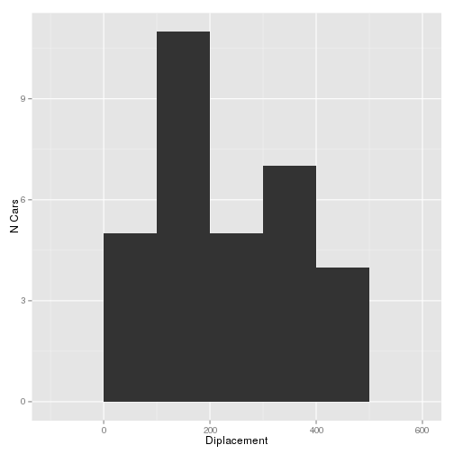

# Minimal Markdown Example

This is a simple, minimal example of report written in R markdown. The
purpose of this report is two fold:

1. To enlighten you about the relationship between engine displacement
   and gas mileage.
2. Provide an accessible introduction to Literate Programming.


```r
## Init R and Config
library(ggplot2)
data(mtcars)
```

## Engine Displacement


```r
qplot(disp, data=mtcars, xlab="Diplacement", ylab="N Cars", geom="histogram", binwidth=100)
```

 


```r
qplot(mpg, data=mtcars, xlab="MPG", ylab="N Cars", geom="histogram", binwidth=5)
```

 


```r
ggplot(data = mtcars, aes(x=disp, y=mpg)) + geom_point(shape=1) + geom_smooth(method=lm)
```

 


```r
cor( mtcars$disp, mtcars$mpg)
```

```
## [1] -0.8475514
```
